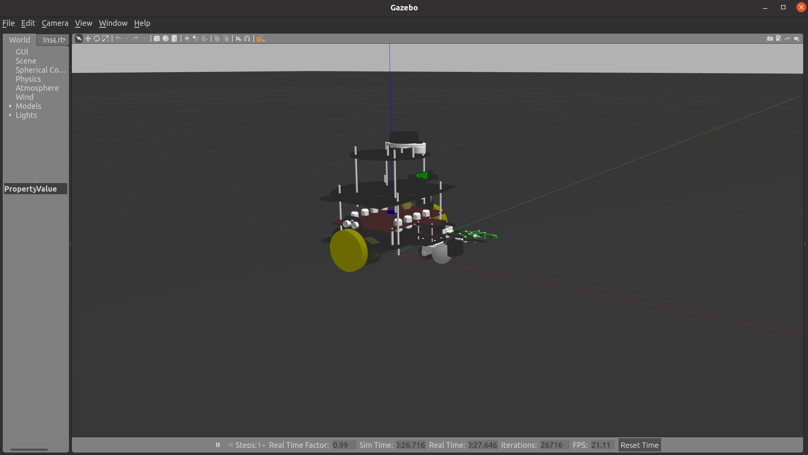

# Tortasim
The official repository serves as the designated platform for simulating the Tortabot Robot within the Gazebo simulation environment. This comprehensive repository encompasses all the essential components, codebase, and resources necessary for accurately replicating the Tortabot Robot's functionalities, allowing developers and researchers to conduct in-depth simulations, test various scenarios, and refine the robot's performance in a virtual Gazebo setting. Through this centralized hub, users can access the latest updates, documentation, and collaborative tools to foster a community-driven approach in enhancing the simulation capabilities and overall development of the Tortabot Robot.

